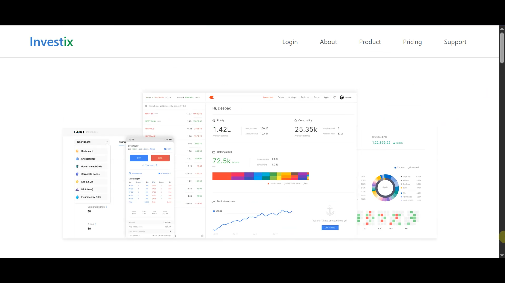
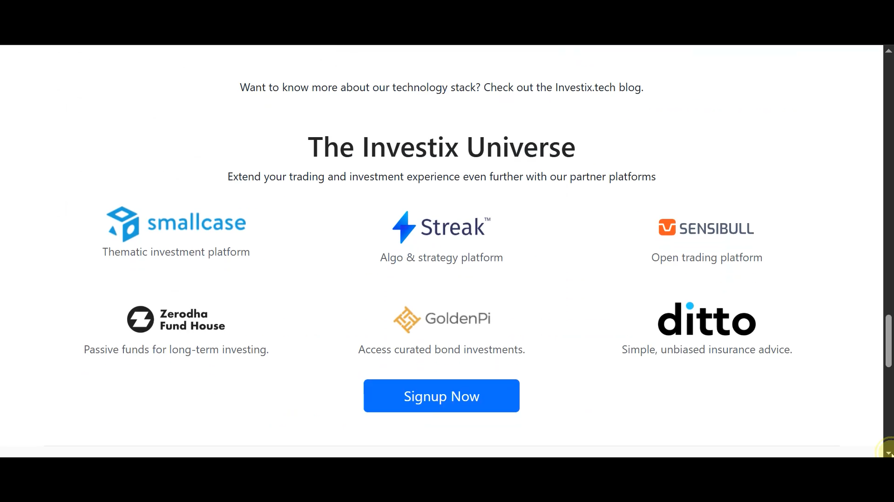
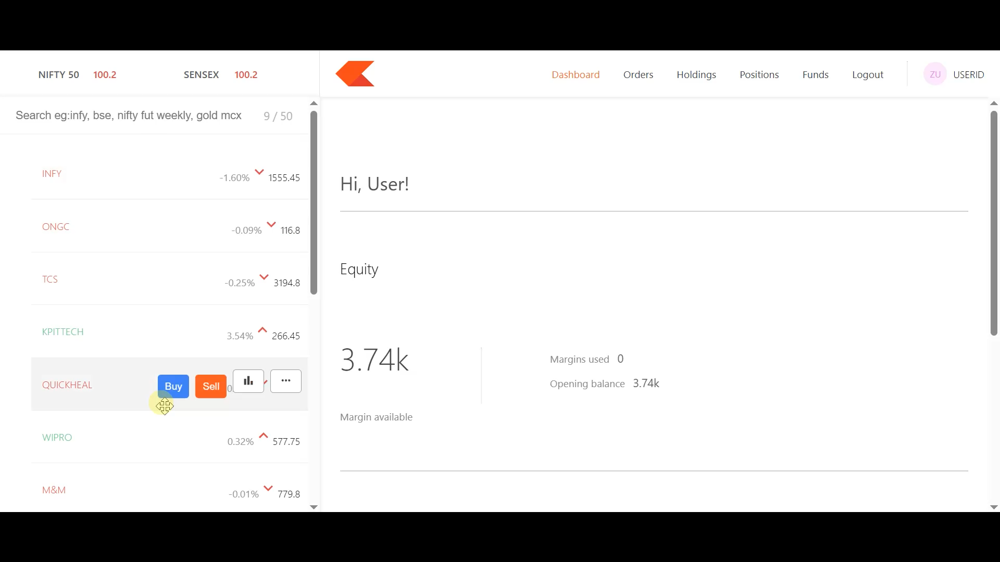
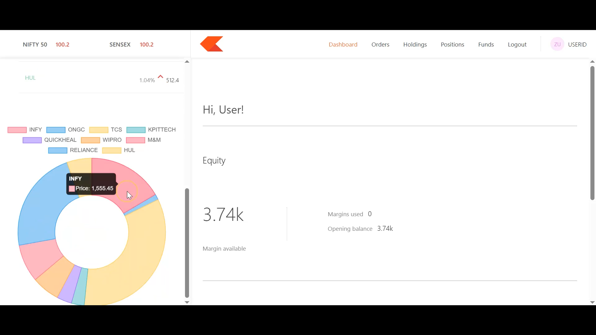
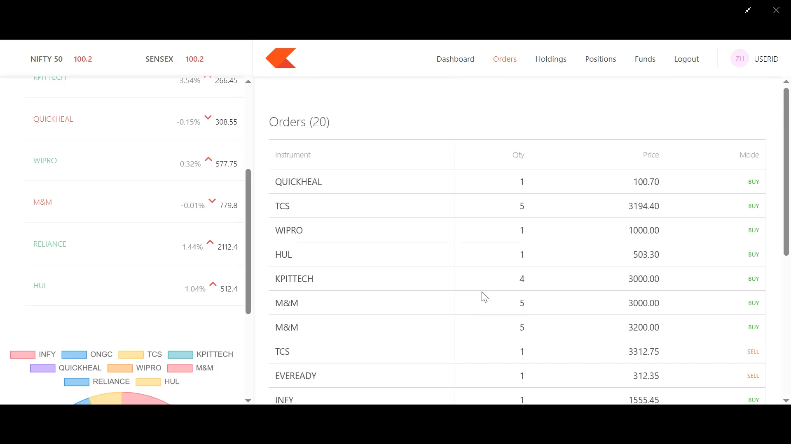
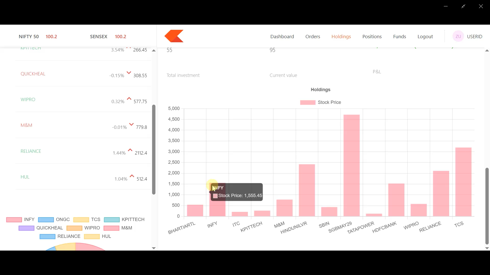
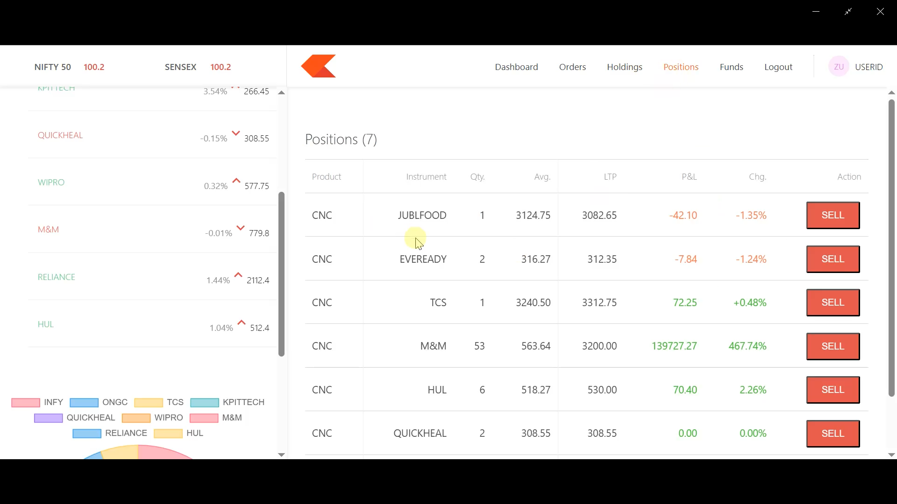
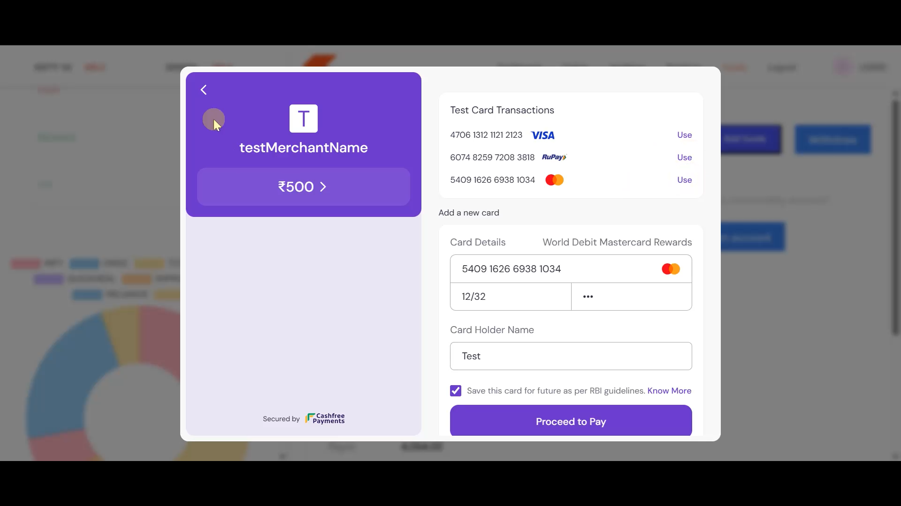

<p align="center">  
  
  
  
  
  
  
</p>    
 
# 📈 Investix – Stock Trading & Portfolio Management System

Investix is a **full-stack stock trading simulation platform** inspired by modern fintech dashboards like Zerodha.

The project is built using **Node.js, Express, MongoDB, React, Material UI, and Chart.js**, and includes **authentication, portfolio tracking, stock visualization, and Cashfree payment integration**.

It addresses the challenge of understanding stock portfolio management and fintech dashboard design by providing a structured, modern, and scalable trading system with secure authentication and payment handling.

---

## 🖼 Application Preview

### 🌐 Landing page Overview



### 📊 Trading Dashboard


### 💼 Portfolio Management (Orders / Holdings / Positions)






### 💳 Secure Payment Integration (Cashfree)

## 🚀 Features

- 🔐 Secure User Registration & Login (Passport.js)
- 📊 Interactive Portfolio Dashboard
- 📈 Stock Price Visualization using Chart.js
- 💼 Buy/Sell Stock Simulation Interface
- 💳 Cashfree Payment Gateway Integration
- 🧠 RESTful API using Express 5
- 🗄 MongoDB Database with Mongoose ODM
- 🎨 Modern UI built with React 19 & Material UI
- 🔄 Axios-based frontend-backend communication
- 🌐 Routing using React Router v7

---

## 🧠 Key Technical Decisions

- Implemented RESTful architecture for scalable API design.
- Used Passport.js with session-based authentication for secure login handling.
- Integrated Cashfree Payment Gateway for secure transaction processing.
- Adopted Mongoose ODM for structured MongoDB schema modeling.
- Separated Landing Page, Dashboard, and Backend into modular layers.
- Used Material UI for consistent fintech-grade UI design.
- Integrated Chart.js for interactive portfolio and stock data visualization.
- Environment-based configuration using dotenv for security and deployment readiness.

---

## 🎥 Project Demo Video

[](https://youtu.be/52eSnVM5234)

---

## 🛠 Tech Stack

| Layer | Technology |
|-------|------------|
| Backend | Node.js, Express 5.2.1 |
| Database | MongoDB, Mongoose 9.1.1 |
| Authentication | Passport.js, passport-local-mongoose |
| Payment Gateway | Cashfree PG (v5.1.0) |
| Dashboard | React 19.2.3 |
| UI Framework | Material UI 7.3.6 |
| Charts | Chart.js 4.5.1, react-chartjs-2 |
| Routing | React Router DOM 7.11.0 |
| API Communication | Axios |
| Environment | dotenv |
| Dev Tools | Nodemon |

---

```
🗂️ Investix/
├── 📁 backend/
│   ├── index.js
│   ├── 📁 models/
│   │   ├── HoldingsModel.js
│   │   ├── OrdersModel.js
│   │   ├── PositionsModel.js
│   │   └── WalletsModel.js
│   │
│   ├── 📁 schema/
│   │   ├── HoldingsSchema.js
│   │   ├── PositionsSchema.js
│   │   └── OrdersSchema.js
│   │
│   ├── 📁 controllers/
│   └── package.json
│
├── 📁 dashboard/
│   ├── 📁 src/
│   │   ├── 📁 components/
│   │   │   ├── BuyActionWindow.css
│   │   │   ├── BuyActionWindow.js
│   │   │   ├── Dashboard.js
│   │   │   ├── DoughnutChart.js
│   │   │   ├── Funds.js
│   │   │   ├── GeneralContext.js
│   │   │   ├── Holdings.js
│   │   │   ├── Home.js
│   │   │   ├── Logout.js
│   │   │   ├── Menu.js
│   │   │   ├── Orders.js
│   │   │   ├── Positions.js
│   │   │   ├── Summary.js
│   │   │   └── VerticalGraph.js
│   │   │
│   │   ├── 📁 data/
│   │   ├── index.css
│   │   └── index.js
│   │
│   └── package.json
│
├── 📁 frontend/
│   ├── 📁 src/
│   │   ├── 📁 Landing_page/
│   │   │   ├── 📁 About/
│   │   │   ├── 📁 Home/
│   │   │   ├── 📁 Pricing/
│   │   │   ├── 📁 Products/
│   │   │   ├── 📁 Support/
│   │   │   ├── Footer.js
│   │   │   ├── Navbar.js
│   │   │   ├── NotFound.js
│   │   │   └── OpenAccount.js
│   │
│   └── package.json
│
└── README.md
```


---

## ⚙️ Getting Started

### Prerequisites

- Node.js (v16+ recommended)
- MongoDB (Local or MongoDB Atlas)
- npm
- Git

---

### 1️⃣ Backend Setup

```
cd backend
npm install
npm start
```

### Create a .env file:

```
MONGO_URI=your_mongodb_connection_string
CASHFREE_APP_ID=your_cashfree_app_id
CASHFREE_SECRET_KEY=your_cashfree_secret_key
```

### 2️⃣ Dashboard Setup

```
cd dashboard
npm install
npm start
```

### 2️ Frontend Setup
```
cd frontend
npm install
npm start
```

## 🚀 Future Enhancements

- 🔄 Live stock market API integration (Alpha Vantage / Finnhub)
- 📊 Advanced analytics with technical indicators
- 🔐 JWT-based authentication
- ☁️ Cloud deployment (Render + Vercel + MongoDB Atlas)

## 🤝 Connect with Me

Feel free to reach out for feedback, collaborations, or just to say hi!  

- **LinkedIn:** [Aditya Deshmukh](https://www.linkedin.com/in/aditya-deshmukh14/)
- **Twitter:** [@Aadi_deshmukh14](https://x.com/Aadi_deshmukh14)
- **GitHub:** [Aditya-deshmukh-1410](https://github.com/Aditya-deshmukh-1410)  


